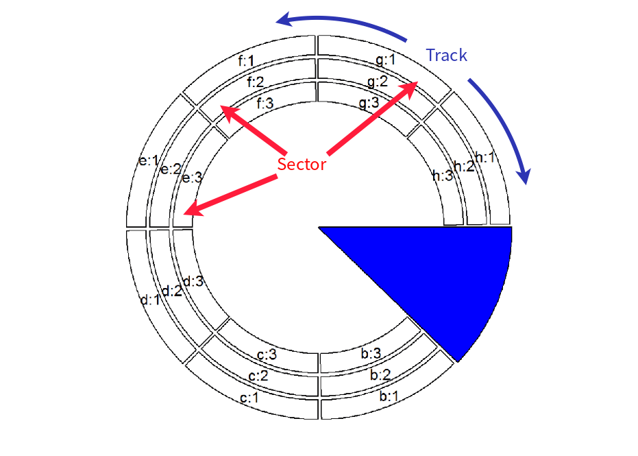

```{r setup, include=FALSE}
knitr::opts_chunk$set(echo = FALSE)
```

## Chord diagram

* A graphical method of displaying the inter-relationships between data in a matrix. 
* The data are arranged radially around a circle with the relationships between the data points typically drawn as arcs connecting the data.

[](http://felixfan.github.io/circos/)


# circlize - a R package for circular visualization

## Intro


## Coordinate transformation

+ Data coordinate systems
+ Polar coordinate systems
+ Canvas coordinate systems


## Layout



## Rules of using circlize to make circular plot


## How to use circlize?

```{r usage, eval = FALSE, echo = TRUE}
circos.initialize(factors, xlim)

circos.track(factors, ylim)

for(sector.index in all.sector.index) {
    circos.points(x1, y1, sector.index)
    circos.lines(x2, y2, sector.index)
}

...
```

# An example

## Step 1 - Generate random data

```{r generateData, echo = TRUE}
set.seed(999)
n = 1000
df = data.frame(factors = sample(letters[1:8], n, replace = TRUE),
    x = rnorm(n), y = runif(n))
dplyr::tbl_df(df)
```

## Step 2 - Initialize a circular layout

```{r initialize, echo = TRUE}
suppressMessages(library(circlize))
circos.par("track.height" = 0.1)
circos.initialize(factors = df$factors, x = df$x)
```

## Step 3 - Add a track and drawing plot

```{r addtrackandplot, echo = TRUE, eval = FALSE}
circos.track(factors = df$factors, y = df$y,
    panel.fun = function(x, y) {
        circos.text(CELL_META$xcenter, CELL_META$cell.ylim[2] + uy(5, "mm"), CELL_META$sector.index)
        circos.axis(labels.cex = 0.6)
})
col = rep(c("#FF0000", "#00FF00"), 4)
circos.trackPoints(df$factors, df$x, df$y, col = col, pch = 16, cex = 0.5)
circos.text(-1, 0.5, "text", sector.index = "a", track.index = 1)
```


## Step 4 - Add a track and drawing plot

```{r addnewtrackandplot, echo = TRUE, eval = FALSE}
bgcol = rep(c("#EFEFEF", "#CCCCCC"), 4)
circos.trackHist(df$factors, df$x, bin.size = 0.2, bg.col = bgcol, col = NA)
```


## Repeat Step 3 / Step 4


# More about using circlize to visualize your data

## Linking genomic regions


## Representation of transcript isoforms


## Nested zooming


## Resources

1. [Circlize document](https://jokergoo.github.io/circlize_book/book/)
2. [R graph gallery](https://www.r-graph-gallery.com/chord-diagram/)

# Thank you!